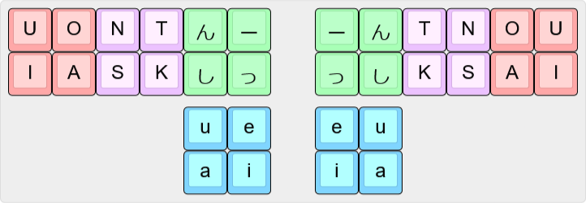

# Plover_Japanese_Chimedori

Plover用の略語に頼らない日本語入力システム

## インストール
Plover Wikiの[手順](https://plover.wiki/index.php/Plugins#Plugins_not_on_PyPI)に従ってください。

## 使い方
左右それぞれについて、一音目・二音目・三音目を入力するためのキーを押します。  
これらは左手一音目・左手二音目・左手三音目・右手一音目・右手二音目・右手三音目の順で出力されます。

### レイアウト

親指で`u` `a` `e` `i`、人差し指で`ん` `し` `ー` `っ`、中指で`T` `K`、薬指で`N` `S`、小指で`U` `I` `O` `A`を押します。  
親指キーが二段になっている関係上、キーボードによっては使えない（使いにくい）可能性があります。

### かな表
#### 一音目
| | |K|S|T|N|NS|TK|SK|NTK|ST|NK|STK|NT|NSK|NST|NSTK|
|-|-|-|-|-|-|--|--|--|---|--|--|---|--|---|---|----|
|A|あ|か|さ|た|な|は|ま|ら|わ|つぁ|が|ざ|だ|ば|ぱ|ぁ|
|I|い|き|し|てぃ|に|ひ|み|り|うぃ|ち|ぎ|じ|ぢ|び|ぴ|ぃ|
|U|う|く|す|とぅ|ぬ|ふ|む|る|ヴ|つ|ぐ|ず|づ|ぶ|ぷ|ぇ|
|OA|え|け|せ|て|ね|へ|め|れ|うぇ|ちぇ|げ|ぜ|で|べ|ぺ|ぇ|
|O|お|こ|そ|と|の|ほ|も|ろ|を|つぉ|ご|ぞ|ど|ぼ|ぽ|ぉ|
|UO|や|きゃ|しゃ|てゃ|にゃ|ひゃ|みゃ|りゃ||ちゃ|ぎゃ|じゃ|ぢゃ|びゃ|ぴゃ|ゃ|
|IA|ゆ|きゅ|しゅ|てゅ|にゅ|ひゅ|みゅ|りゅ||ちゅ|ぎゅ|じゅ|ぢゅ|びゅ|ぴゅ|ゅ|
|UI|よ|きょ|しょ|てょ|にょ|ひょ|みょ|りょ||ちょ|ぎょ|じょ|ぢょ|びょ|ぴょ|ょ|

#### 二音目
|入力|かな|
|-|-|
|a|あ|
|i|い|
|ua|う|
|ei|え|
|ai|お|

#### 三音目
|入力|かな|
|-|-|
|ん|ん|
|し|し|
|ー|ー|
|っ|っ|
|んし|んし|
|ーっ|しん|
|しっ|しっ|
|んー|っし|
|んしーっ|しー|

#### 特殊
|入力|出力|
|----|----|
| -N |前の入力を削除|
| -S |エンター|

### その他
- てゃ・てゅ・てょ・右手ゃ・右手ゅ・右手ょなど、仕様品と思われる拍は別の文字列に割り当て直すと良いでしょう。
